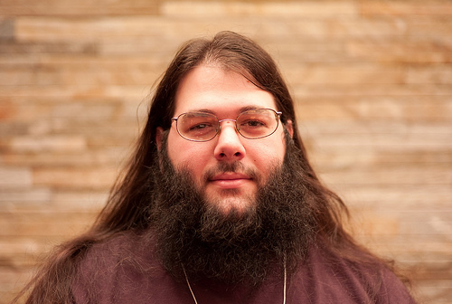

talk-ideas
==========

My talk proposals

Speaker Bio
-----------

Noah Kantrowitz is a web developer turned infrastructure automation enthusiast, and all around engineering rabble-rouser. By day he builds tools and teaches, and by night he works with the Python Software Foundation infrastructure team. He is an active member of the Chef community, and enjoys merge commits, cat pictures, and beards.

Headshot
--------

